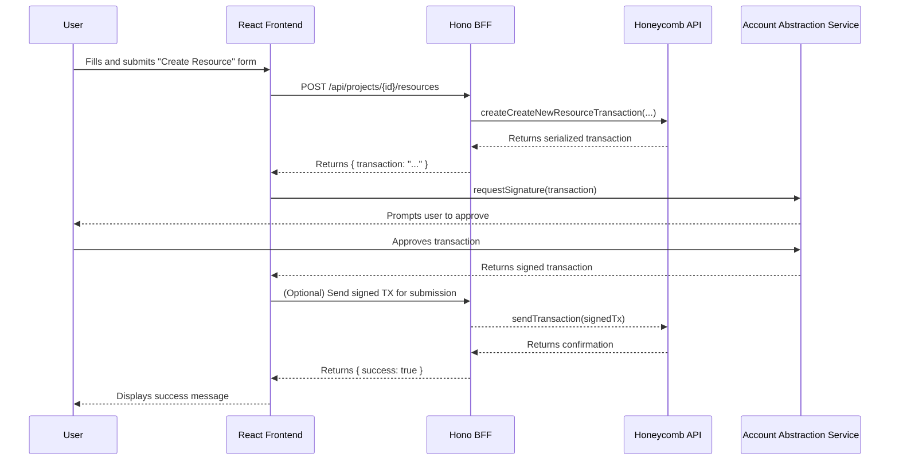

# Honeycomb Protocol Dashboard Fullstack Architecture Document

## Introduction
This document outlines the complete fullstack architecture for the Honeycomb Protocol Dashboard, including backend systems, frontend implementation, and their integration. It serves as the single source of truth for AI-driven development, ensuring consistency across the entire technology stack.

### Starter Template or Existing Project
The project will be built using a standard, high-quality monorepo starter template (e.g., one using Bun Workspaces with Turborepo) to accelerate setup and enforce best practices for the selected BHVR (Bun, Hono, Vite, React) stack.

### Change Log
| Date | Version | Description | Author |
| --- | --- | --- | --- |
| 2025-07-22 | 1.0 | Initial architecture draft | Winston, Architect |

## High Level Architecture

### Technical Summary
This architecture describes a modern, full-stack web application built using the BHVR (Bun, Hono, Vite, React) stack within a monorepo structure. The system features a responsive React frontend that communicates with a lightweight Hono Backend-for-Frontend (BFF). User authentication is handled via a social login/account abstraction service, which creates and manages user wallets. The entire application is designed to be deployed as containerized services on a modern cloud platform, interacting directly with the external Honeycomb Protocol GraphQL API.

### Platform and Infrastructure Choice
* **Platform:** **Fly.io** is recommended for its excellent developer experience in deploying containerized applications with support for Bun.
* **Key Services:**
    * **Web App Service**: For hosting the Vite/React static frontend.
    * **API Service**: For running the Hono BFF.

### Repository Structure
* **Structure:** Monorepo
* **Monorepo Tool:** Turborepo with Bun Workspaces
* **Package Organization:**
    * `apps/web`: The Vite/React frontend application.
    * `apps/api`: The Hono BFF service.
    * `packages/shared-types`: Shared TypeScript types.

### High Level Architecture Diagram
```mermaid
graph TD
    User --> Browser[React/Vite Frontend on Fly.io];
    Browser --> AAService[Account Abstraction Service e.g., Crossmint];
    Browser --> BFF[Hono BFF on Fly.io];
    BFF --> HPL_API[Honeycomb Protocol GraphQL API];
````

### Architectural Patterns

  * **Monorepo Pattern:** Using Turborepo and Bun Workspaces to manage frontend, backend, and shared code in a single repository.
  * **Backend-for-Frontend (BFF) Pattern:** The Hono API will serve as a dedicated backend for our React frontend to abstract complexities of the Honeycomb API.
  * **Component-Based UI Pattern:** The frontend will be built with reusable React components.
  * **Containerization Pattern:** Both the frontend and backend applications will be deployed as containerized services.

## Tech Stack

### Technology Stack Table

| Category | Technology | Version | Purpose | Rationale |
| :--- | :--- | :--- | :--- | :--- |
| **Frontend Language** | TypeScript | `~5.5` | Statically typed language for frontend code. | Provides type safety and better developer experience. |
| **Frontend Framework** | React | `~18.3` | UI library for building the user interface. | Chosen as part of the core BHVR stack. |
| **UI Component Library** | Shadcn/ui + Tailwind CSS | `~0.8` | UI components and styling. | A modern, accessible, and highly customizable component library. |
| **State Management** | Zustand | `~4.5` | Lightweight global state management. | Simple, unopinionated, and avoids boilerplate. |
| **Backend Language** | TypeScript | `~5.5` | Statically typed language for backend code. | Ensures type consistency across the full stack. |
| **Backend Framework** | Hono | `~4.4` | Fast, lightweight web framework for the BFF. | Chosen as part of the core BHVR stack. |
| **API Style** | GraphQL Client | `~17.0` | Query language for the client to interact with HPL API. | The Honeycomb Protocol API is GraphQL-based. |
| **Authentication** | Crossmint | `~2.0` | Account abstraction and embedded wallets. | Fulfills the requirement for social logins. |
| **Frontend Testing**| Vitest + RTL | `~1.6` | Unit and component testing for the frontend. | Natively integrates with Vite for a fast testing experience. |
| **Backend Testing** | Vitest | `~1.6` | Unit and integration testing for the backend. | Bun has native support for Vitest. |
| **E2E Testing** | Playwright | `~1.45`| End-to-end testing for the entire application. | A modern and reliable tool for cross-browser E2E testing. |
| **Runtime / Build Tool** | Bun + Vite | `~1.1` / `~5.2` | Core runtime, package manager, and build tool. | Chosen as part of the core BHVR stack. |
| **IaC Tool** | Docker | `~27.0` | Containerization for consistent deployments. | Provides a portable and standard way to deploy our services. |
| **CI/CD** | GitHub Actions | `N/A` | Automated build, test, and deployment pipelines. | Tightly integrated with GitHub. |

## Data Models

### Project

  * **Purpose:** Represents a single Honeycomb project.

#### TypeScript Interface

```typescript
export interface HoneycombProject {
  address: string;
  authority: string;
  name: string;
}
```

### Profile & User

  * **Purpose:** Represents a user's project-specific data (`Profile`) and their global account (`User`).

#### TypeScript Interfaces

```typescript
export interface ProfileInfo {
  name: string | null;
  bio: string | null;
  pfp: string | null;
}
export interface PlatformData {
  xp: number;
  achievements: number[];
}
export interface HoneycombProfile {
  address: string;
  project: string;
  userId: number;
  info: ProfileInfo;
  platformData: PlatformData;
}
export interface UserInfo {
  username: string;
  name: string;
  bio: string;
  pfp: string;
}
export interface Wallets {
  shadow: string;
  wallets: string[];
}
export interface HoneycombUser {
  id: number;
  address: string;
  info: UserInfo;
  wallets: Wallets;
}
```

### Resource & Character Model

  * **Purpose:** Represents game assets (`Resource`) and templates for creating characters (`CharacterModel`).

#### TypeScript Interfaces

```typescript
export interface ResourceKind {
  kind: string;
  params: { decimals?: number; };
}
export interface ResourceStorage {
  kind: 'AccountState' | 'LedgerState';
}
export interface HoneycombResource {
  address: string;
  project: string;
  mint: string;
  storage: ResourceStorage;
  kind: ResourceKind;
}
export interface CharacterConfig {
  kind: 'Wrapped' | 'Assembled';
}
export interface HoneycombCharacterModel {
  address: string;
  project: string;
  config: CharacterConfig;
}
```

## API Specification

### REST API Specification

This OpenAPI 3.0 spec outlines the RESTful API that the Hono BFF will expose to the React frontend.

```yaml
openapi: 3.0.0
info:
  title: Honeycomb Dashboard BFF API
  version: 1.0.0
servers:
  - url: /api
paths:
  /projects:
    get:
      summary: Get Projects for User
  /projects/{projectId}/profiles:
    get:
      summary: Get Profiles for a Project
  /projects/{projectId}/resources:
    post:
      summary: Create a New Resource
  /projects/{projectId}/resources/{resourceId}/mint:
    post:
      summary: Mint a Resource
  /projects/{projectId}/character-models:
    get:
      summary: Get Character Models
    post:
      summary: Create a New Character Model
```

## Components

### Component List

  * **Authentication Service (Frontend/Backend):** Manages user session via Crossmint SDK.
  * **Honeycomb API Client (Backend):** Handles all communication with the Honeycomb GraphQL API.
  * **BFF API Layer (Backend):** Implements the RESTful API for the frontend using Hono.
  * **Project Management UI (Frontend):** The main dashboard "hub" components.
  * **Asset Management UI (Frontend):** The components for the individual management "spokes" (Resources, Characters, etc.).

## External APIs

  * **Honeycomb Protocol GraphQL API:** The core external service providing all blockchain functionality.
  * **Crossmint:** The account abstraction service used for social login and embedded wallet management.

## Core Workflows

### Create New Resource Workflow



## Database Schema

No dedicated database is required for the MVP. All state is managed by the Honeycomb Protocol.

## Frontend Architecture

  * **Component Organization:** A feature-based directory structure (`src/features/...`).
  * **State Management:** Zustand for global state, React Hooks for local state.
  * **Routing:** `react-router-dom` with a centralized route configuration.
  * **Services:** A dedicated service layer for all API communication.

## Backend Architecture

  * **Approach:** A lightweight, containerized Hono BFF running on Bun.
  * **Routing:** File-based routing (e.g., `src/routes/projects.ts`).
  * **Data Access:** All data access is handled by the `Honeycomb API Client` service.
  * **Authentication:** A simple middleware will handle credentials passed from the frontend.

## Unified Project Structure

```plaintext
honeycomb-dashboard/
├── apps/
│   ├── web/      # React + Vite Frontend
│   └── api/      # Hono BFF
├── packages/
│   ├── shared-types/
│   └── config/
├── infrastructure/
│   └── Dockerfile
├── package.json
└── turborepo.json
```

## Development Workflow

  * **Setup:** `git clone`, `cd ...`, `bun install`.
  * **Run:** `bun dev` (starts both frontend and backend).
  * **Config:** `.env` files for frontend (`VITE_...`) and backend.

## Deployment Architecture

  * **Strategy:** Frontend static assets and backend BFF deployed as separate, containerized services on Fly.io.
  * **CI/CD:** A GitHub Actions pipeline will automate linting, testing, building, and deploying on pushes to the `main` branch.

## Security and Performance

  * **Security:** A strict Content Security Policy (CSP), rate limiting on the BFF, input validation, and secure token handling.
  * **Performance:** Focus on small bundle sizes via Vite's code-splitting, backend performance via the Bun/Hono stack, and frontend perceived performance via skeleton screens.

## Testing Strategy

  * **Pyramid:** A focus on co-located unit/component tests (Vitest, RTL), a smaller suite of integration tests, and a few critical E2E tests (Playwright).

## Coding Standards

  * **Key Rules:**
    1.  Always use the `packages/shared-types` for data models.
    2.  Frontend must go through the BFF for all API calls.
    3.  Use a config module for environment variables.
    4.  Use global error handling middleware in the BFF.
    5.  Use immutable state updates in Zustand.

## Error Handling Strategy

  * **Format:** The BFF will return a standardized `ApiError` JSON object for all errors.
  * **Flow:** The frontend catches errors from the BFF, logs technical details, and shows a user-friendly toast notification. The BFF catches errors from the Honeycomb API, logs technical details, and formats the `ApiError` response.

## Monitoring and Observability

  * **Stack:** A combination of platform-native metrics from Fly.io and a dedicated error tracking service like Sentry.
  * **Metrics:** Tracking frontend Core Web Vitals and backend request/error rates and latency.