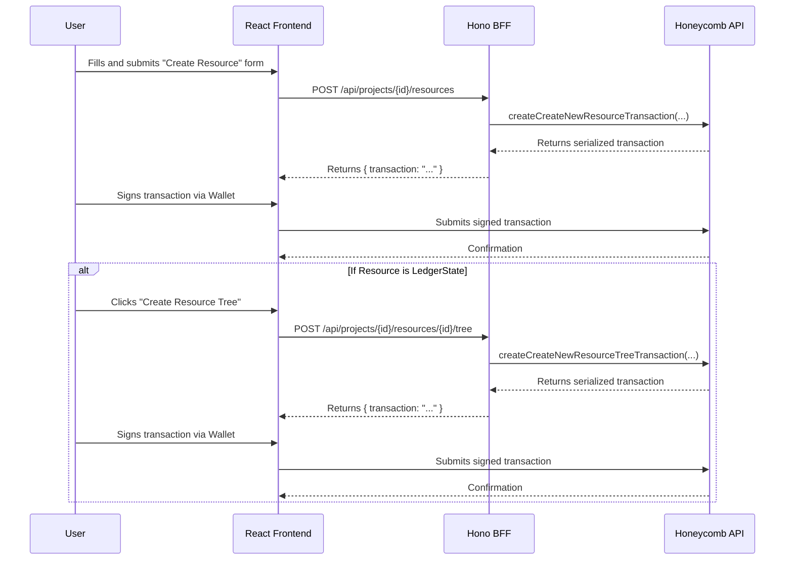
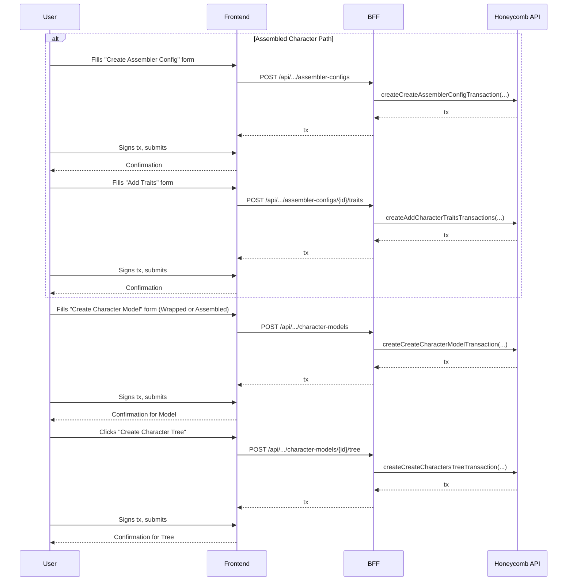

# Core Workflows

## Create New Resource Workflow

```mermaid
sequenceDiagram
    participant User
    participant Frontend as React Frontend
    participant BFF as Hono BFF
    participant HPL_API as Honeycomb API

    User->>Frontend: Fills and submits "Create Resource" form
    Frontend->>BFF: POST /api/projects/{id}/resources
    BFF->>HPL_API: createCreateNewResourceTransaction(...)
    HPL_API-->>BFF: Returns serialized transaction
    BFF-->>Frontend: Returns { transaction: "..." }
    
    User->>Frontend: Signs transaction via Wallet
    Frontend->>HPL_API: Submits signed transaction
    HPL_API-->>Frontend: Confirmation
    
    alt If Resource is LedgerState
        User->>Frontend: Clicks "Create Resource Tree"
        Frontend->>BFF: POST /api/projects/{id}/resources/{id}/tree
        BFF->>HPL_API: createCreateNewResourceTreeTransaction(...)
        HPL_API-->>BFF: Returns serialized transaction
        BFF-->>Frontend: Returns { transaction: "..." }
        User->>Frontend: Signs transaction via Wallet
        Frontend->>HPL_API: Submits signed transaction
        HPL_API-->>Frontend: Confirmation
    end
```

## Create New Character Model Workflow

```mermaid
sequenceDiagram
    participant User
    participant Frontend
    participant BFF
    participant HPL_API as Honeycomb API

    alt Assembled Character Path
        User->>Frontend: Fills "Create Assembler Config" form
        Frontend->>BFF: POST /api/.../assembler-configs
        BFF->>HPL_API: createCreateAssemblerConfigTransaction(...)
        HPL_API-->>BFF: tx
        BFF-->>Frontend: tx
        User->>Frontend: Signs tx, submits
        Frontend-->>User: Confirmation

        User->>Frontend: Fills "Add Traits" form
        Frontend->>BFF: POST /api/.../assembler-configs/{id}/traits
        BFF->>HPL_API: createAddCharacterTraitsTransactions(...)
        HPL_API-->>BFF: tx
        BFF-->>Frontend: tx
        User->>Frontend: Signs tx, submits
        Frontend-->>User: Confirmation
    end

    User->>Frontend: Fills "Create Character Model" form (Wrapped or Assembled)
    Frontend->>BFF: POST /api/.../character-models
    BFF->>HPL_API: createCreateCharacterModelTransaction(...)
    HPL_API-->>BFF: tx
    BFF-->>Frontend: tx
    User->>Frontend: Signs tx, submits
    Frontend-->>User: Confirmation for Model

    User->>Frontend: Clicks "Create Character Tree"
    Frontend->>BFF: POST /api/.../character-models/{id}/tree
    BFF->>HPL_API: createCreateCharactersTreeTransaction(...)
    HPL_API-->>BFF: tx
    BFF-->>Frontend: tx
    User->>Frontend: Signs tx, submits
    Frontend-->>User: Confirmation for Tree
```
