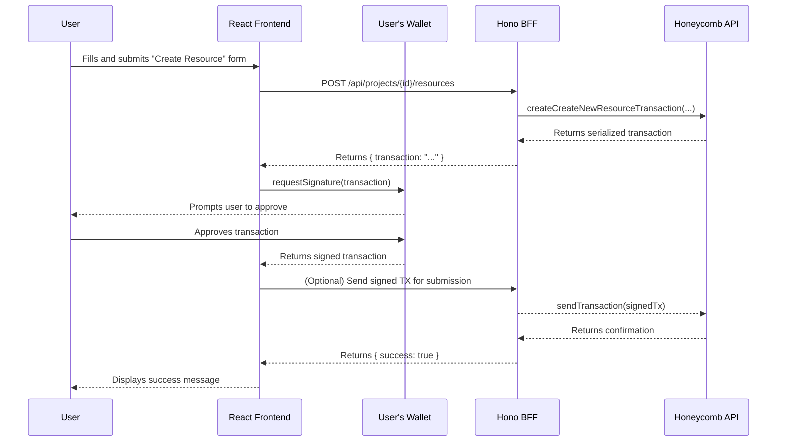

# Core Workflows

## Create New Resource Workflow

```mermaid
sequenceDiagram
    participant User
    participant Frontend as React Frontend
    participant Wallet as User's Wallet
    participant BFF as Hono BFF
    participant HPL_API as Honeycomb API

    User->>Frontend: Fills and submits "Create Resource" form
    Frontend->>BFF: POST /api/projects/{id}/resources
    BFF->>HPL_API: createCreateNewResourceTransaction(...)
    HPL_API-->>BFF: Returns serialized transaction
    BFF-->>Frontend: Returns { transaction: "..." }
    Frontend->>Wallet: requestSignature(transaction)
    Wallet-->>User: Prompts user to approve
    User->>Wallet: Approves transaction
    Wallet-->>Frontend: Returns signed transaction
    Frontend->>BFF: (Optional) Send signed TX for submission
    BFF-->>HPL_API: sendTransaction(signedTx)
    HPL_API-->>BFF: Returns confirmation
    BFF-->>Frontend: Returns { success: true }
    Frontend-->>User: Displays success message
```
