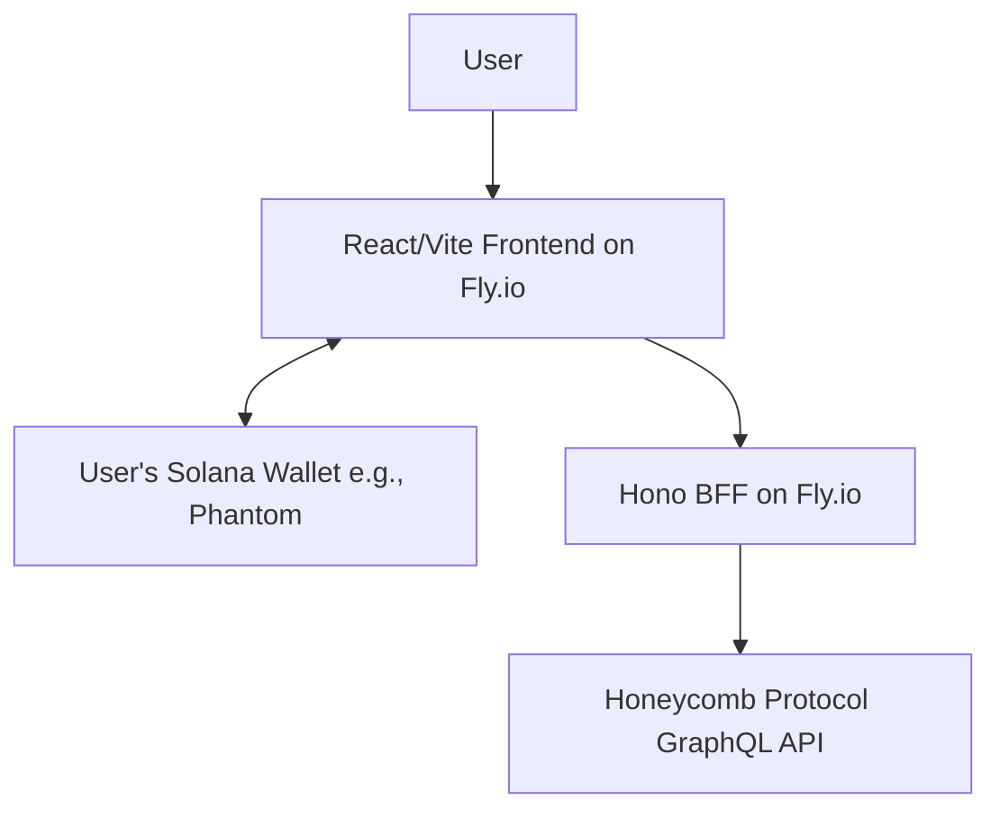

# High Level Architecture

## Technical Summary
This architecture describes a modern, full-stack web application built using the BHVR (Bun, Hono, Vite, React) stack within a monorepo structure. The system features a responsive React frontend that communicates with a lightweight Hono Backend-for-Frontend (BFF). User authentication is handled via a **direct Solana wallet connection**, interacting with the external Honeycomb Protocol GraphQL API.

## Platform and Infrastructure Choice
* **Platform:** **Fly.io** is recommended for its excellent developer experience in deploying containerized applications with support for Bun.
* **Key Services:**
    * **Web App Service**: For hosting the Vite/React static frontend.
    * **API Service**: For running the Hono BFF.

## Repository Structure
* **Structure:** Monorepo
* **Monorepo Tool:** Turborepo with Bun Workspaces
* **Package Organization:**
    * `app/client`: The Vite/React frontend application.
    * `app/server`: The Hono BFF service.
    * `app/shared`: Shared TypeScript types.

## High Level Architecture Diagram

## Architectural Patterns

  * **Monorepo Pattern:** Using Turborepo and Bun Workspaces to manage frontend, backend, and shared code in a single repository.
  * **Backend-for-Frontend (BFF) Pattern:** The Hono API will serve as a dedicated backend for our React frontend to abstract complexities of the Honeycomb API.
  * **Component-Based UI Pattern:** The frontend will be built with reusable React components.
  * **Containerization Pattern:** Both the frontend and backend applications will be deployed as containerized services.
