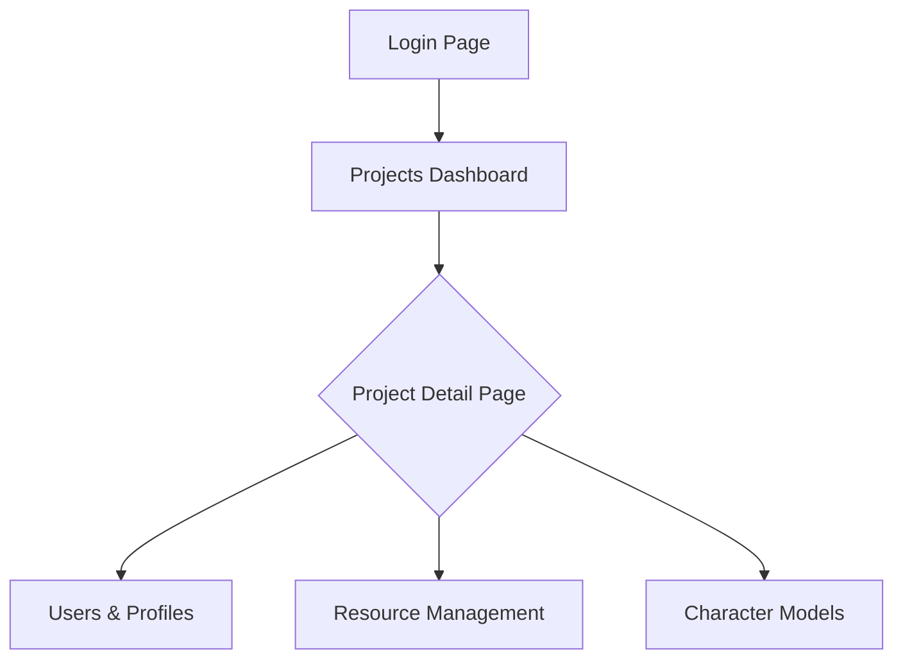
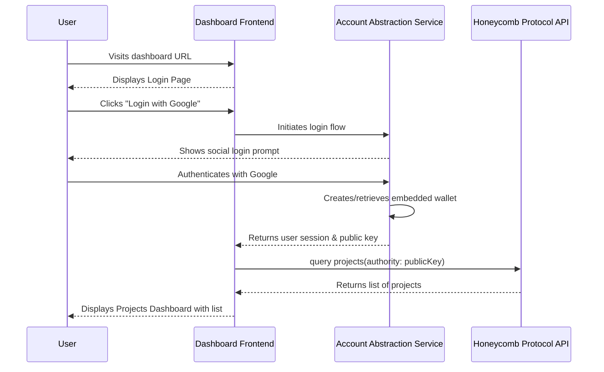
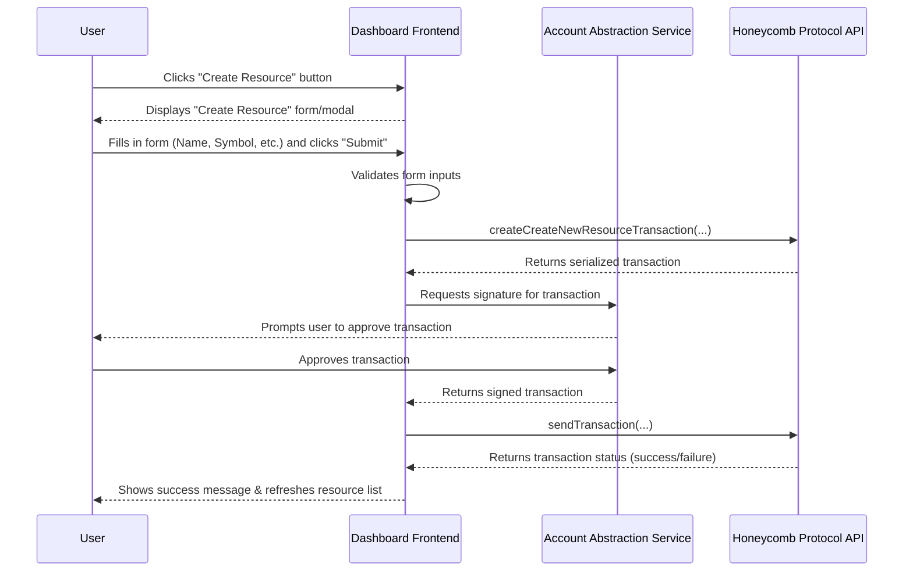
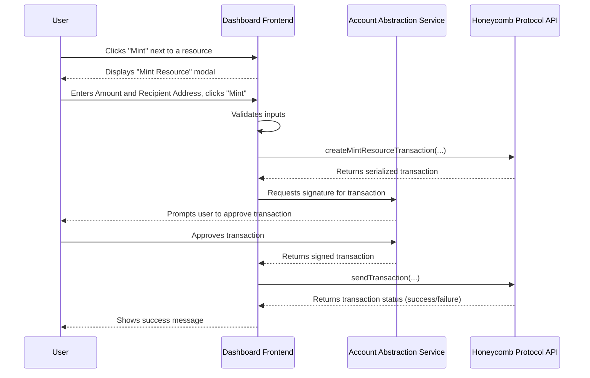

# Honeycomb Protocol Dashboard UI/UX Specification

## Introduction
This document defines the user experience goals, information architecture, user flows, and visual design specifications for the Honeycomb Protocol Dashboard. It serves as the foundation for visual design and frontend development, ensuring a cohesive and user-centered experience.

### Overall UX Goals & Principles

#### Target User Personas
* **The Web3 Newcomer**: A skilled game developer who is new to blockchain concepts. They prioritize ease of use, clear guidance, and abstracting away complexity.
* **The Web3 Veteran**: An experienced blockchain developer who values efficiency, data density, and powerful features. They need to perform tasks quickly and with minimal friction.

#### Usability Goals
* **Ease of Learning**: A new user can create a project and a new resource within 5 minutes of their first login.
* **Efficiency of Use**: An experienced user can perform common tasks (like minting a resource) with the fewest possible clicks.
* **Clarity**: The interface should clearly communicate on-chain states, transaction statuses, and potential errors, preventing user confusion.

#### Design Principles
1.  **Clarity Over Cleverness**: Prioritize clear, unambiguous language and standard UI patterns over novel but potentially confusing design innovations.
2.  **Efficiency by Default**: Design workflows to be as streamlined as possible, anticipating user needs and providing shortcuts for power users.
3.  **Consistency is Key**: Use a consistent design language, component library, and interaction patterns throughout the application to create a predictable and reliable experience.

## Information Architecture (IA)

### Site Map / Screen Inventory
This diagram shows the primary screens and their relationships within the dashboard.

### Navigation Structure

  * **Primary Navigation:** A persistent, global sidebar will be present after login. For the MVP, this will contain a single primary link to the "Projects Dashboard". This allows for future global sections (like global settings or help docs) to be added easily.
  * **Secondary Navigation:** When a user clicks into a specific project (the "Project Detail Page"), a secondary navigation will appear (e.g., as tabs or a sub-menu). This navigation will contain links to the project-specific sections: "Users & Profiles", "Resource Management", and "Character Models".
  * **Breadcrumb Strategy:** A breadcrumb trail will be present at the top of the main content area to show the user's current location, for example: `Projects / My Awesome Game / Resources`.

## User Flows

### First-Time Login & Project Viewing

**User Goal:** A new user successfully logs in via their social account for the first time, and upon success, they can see their list of associated Honeycomb projects.
**Entry Points:** The main landing page of the dashboard application.
**Success Criteria:** The user's project list is successfully displayed, or a "no projects found" message is shown.

#### Flow Diagram

**Edge Cases & Error Handling:**

  * If social login fails, the user is shown an error message and remains on the login page.
  * If the Account Abstraction service fails, a generic "Login failed, please try again" message is displayed.
  * If the Honeycomb API call fails, the dashboard displays an error message like "Could not fetch projects."
  * If the API returns an empty list, the dashboard displays a message like "No projects found. Create one to get started\!"

### Creating a New Resource

**User Goal:** A developer wants to define and create a new in-game resource (e.g., "Gold," "Wood") for one of their projects.
**Entry Points:** The "Resource Management" section of the Project Detail Page.
**Success Criteria:** The transaction to create the new resource is successfully signed and confirmed on-chain, and the new resource appears in the dashboard's list of resources for that project.

#### Flow Diagram

**Edge Cases & Error Handling:**

  * **Invalid Form Data:** If the user enters invalid data, the form will show inline error messages, and the "Submit" button will be disabled.
  * **API Failure (Create):** If the initial call to `createCreateNewResourceTransaction` fails, the user is shown an error like "Could not prepare transaction. Please try again."
  * **User Rejection:** If the user rejects the transaction in the signing prompt, the process is cancelled, and the modal closes.
  * **On-Chain Failure:** If the transaction is sent but fails on-chain, the user is shown an error message like "Transaction failed to confirm on the network."

### Minting a Resource

**User Goal:** A developer wants to mint a quantity of an existing resource and send it to a specific user's wallet.
**Entry Points:** The "Resource Management" section, from the list of existing resources.
**Success Criteria:** The mint transaction is successfully confirmed on-chain, and the developer receives confirmation that the assets were sent.

#### Flow Diagram

**Edge Cases & Error Handling:**

  * **Invalid Inputs:** If the amount is not a valid number or the recipient is not a valid Solana address, the form will show inline errors.
  * **API Failure (Create):** If the `createMintResourceTransaction` call fails, an error message is shown to the user.
  * **User Rejection:** If the user denies the transaction signature, the modal closes, and the operation is cancelled.
  * **On-Chain Failure:** If the transaction fails after submission, a clear error message is displayed to the user.

## Wireframes & Mockups

**Primary Design Files:** [Link to definitive design files, e.g., in Figma, will be placed here]

### Key Screen Layouts

#### Project Detail Page

  * **Purpose:** To serve as the central hub for viewing and managing all assets related to a single project.
  * **Key Elements:**
      * **Header:** Displays the project's name prominently.
      * **Breadcrumbs:** Shows the navigation path (e.g., `Projects / My Awesome Game`).
      * **Tab Navigation:** A set of tabs for switching between the main management sections: "Users & Profiles," "Resource Management," and "Character Models."
      * **Content Area:** A large area that displays the content for the currently selected tab.
      * **Primary Action Button:** A context-aware button in the top right of the content area (e.g., "Create Resource" when on the Resources tab).
  * **Interaction Notes:** Clicking a tab should switch the view in the content area instantly without a full page reload. The content area for lists (like resources) should include search and filtering capabilities.
  * **Design File Reference:** [Link to the specific frame for this screen in Figma will be placed here]

## Component Library / Design System

**Design System Approach:**

  * **Recommendation**: We will use a popular, open-source, headless component library (such as Radix UI, which powers Shadcn/ui) as a foundation. This provides a robust and accessible base for our UI components. We will then build our own project-specific components on top of this library, styled according to our branding, to form a custom design system for the Honeycomb Dashboard.

### Core Components

  * **Button**
      * **Purpose:** To trigger actions.
      * **Variants:** Primary, Secondary, Destructive.
      * **States:** Default, Hover, Focused, Disabled, Loading.
  * **Input Field**
      * **Purpose:** For user text entry in forms.
      * **States:** Default, Focused, Error, Disabled.
  * **Modal**
      * **Purpose:** To display contextual forms or confirmation messages.
      * **Variants:** Form Modal, Confirmation Modal.
  * **Table**
      * **Purpose:** To display lists of data (e.g., projects, resources).
      * **Features:** Sorting, Filtering, Pagination.
  * **Tabs**
      * **Purpose:** To handle the secondary navigation on the Project Detail page.
      * **States:** Active, Inactive, Hover.

## Branding & Style Guide

### Visual Identity

  * **Brand Guidelines:** [Link to existing brand guidelines, if available]

### Color Palette

| Color Type | Hex Code | Usage |
| :--- | :--- | :--- |
| Primary | `#4F46E5` | Interactive elements, buttons, links, highlights. |
| Secondary | `#6B7280` | Secondary text, borders, inactive elements. |
| Accent | `#EC4899` | Special highlights, callouts. |
| Success | `#22C55E` | Positive feedback, confirmations. |
| Warning | `#F59E0B` | Cautions, important notices. |
| Error | `#EF4444` | Errors, destructive actions. |
| Neutral | `#111827` / `#FFFFFF` | Text, backgrounds (supports dark/light modes). |

### Typography

  * **Primary Font Family:** system-ui, -apple-system, BlinkMacSystemFont, 'Segoe UI', Roboto, Helvetica, Arial, sans-serif
  * **Type Scale:**
      * **H1:** 2.25rem (36px), Bold
      * **H2:** 1.875rem (30px), Bold
      * **H3:** 1.5rem (24px), Bold
      * **Body:** 1rem (16px), Regular
      * **Small:** 0.875rem (14px), Regular

### Iconography

  * **Icon Library:** Lucide Icons
  * **Usage Guidelines:** Icons should be used sparingly and always be accompanied by a text label, except in universally understood cases.

### Spacing & Layout

  * **Grid System:** An 8-point grid system will be used. All spacing and component dimensions will be in multiples of 8px.

## Accessibility Requirements

### Compliance Target

  * **Standard:** WCAG 2.1 Level AA

### Key Requirements

  * **Visual:**
      * **Color Contrast:** Text and important UI elements must have a contrast ratio of at least 4.5:1.
      * **Focus Indicators:** All interactive elements must have a clearly visible focus state.
      * **Text Sizing:** Users must be able to resize text up to 200% without loss of functionality.
  * **Interaction:**
      * **Keyboard Navigation:** All functionality must be operable through a keyboard alone.
      * **Screen Reader Support:** The application will be tested for compatibility with modern screen readers.
      * **Touch Targets:** Clickable/tappable areas will be at least 44x44 pixels.
  * **Content:**
      * **Alternative Text:** All meaningful images must have descriptive `alt` text.
      * **Heading Structure:** Pages will use a logical and semantic heading structure.
      * **Form Labels:** All form inputs will have clearly associated labels.

### Testing Strategy

  * A combination of automated tools (e.g., Axe) and manual keyboard/screen reader testing.

## Responsiveness Strategy

### Breakpoints

| Breakpoint | Min Width | Target Devices |
| :--- | :--- | :--- |
| Mobile | 320px | Small to large mobile phones |
| Tablet | 768px | Tablets in portrait and landscape |
| Desktop | 1024px | Laptops and standard desktop monitors |
| Wide | 1536px | Large and ultrawide desktop monitors |

### Adaptation Patterns

  * **Layout Changes:** Layouts will be single-column on Mobile, stacking vertically. Multi-column layouts will be introduced on larger screens.
  * **Navigation Changes:** The main sidebar will be collapsed by default on Mobile and Tablet, accessible via a "hamburger" icon.
  * **Content Priority:** On smaller screens, critical information will be prioritized. Secondary details may be collapsed.
  * **Interaction Changes:** Hover-based interactions will have click/tap-based equivalents.

## Animation & Micro-interactions

### Motion Principles

  * **Purposeful:** All animations must provide feedback, guide attention, or indicate a state change.
  * **Swift:** Animations will be quick (100-300ms) to ensure the interface feels responsive.
  * **Accessible:** Animations will respect the `prefers-reduced-motion` browser setting.

### Key Animations

  * **State Changes:** Subtle transitions for button and element states (hover, focus, loading).
  * **Loading Indicators:** Skeletons screens or subtle spinners for data fetching.
  * **Modal Transitions:** Gentle fade or scale into view.
  * **Notifications:** Success or error notifications will slide into view.

## Performance Considerations

### Performance Goals

  * **Page Load:** Largest Contentful Paint (LCP) of under 2.5 seconds.
  * **Interaction Response:** Interaction to Next Paint (INP) of under 200 milliseconds.
  * **Animation FPS:** Maintain a consistent 60 frames per second (FPS).

### Design Strategies

  * **Optimistic UI Updates:** Update the UI immediately for some actions while the transaction confirms in the background.
  * **Skeleton Screens:** Use skeleton placeholders when loading data-heavy lists.
  * **Lazy Loading:** Load images and off-screen components only when needed.

## Next Steps

### Immediate Actions

1.  Secure final stakeholder approval for this UI/UX Specification document.
2.  Begin the high-fidelity visual design process in a dedicated tool (e.g., Figma), using this document as the official blueprint.
3.  Handoff this document to the Architect to inform the creation of the detailed Frontend Architecture.

### Design Handoff Checklist

  * [x] All user flows documented
  * [x] Component inventory complete
  * [x] Accessibility requirements defined
  * [x] Responsive strategy clear
  * [x] Brand guidelines incorporated
  * [x] Performance goals established
